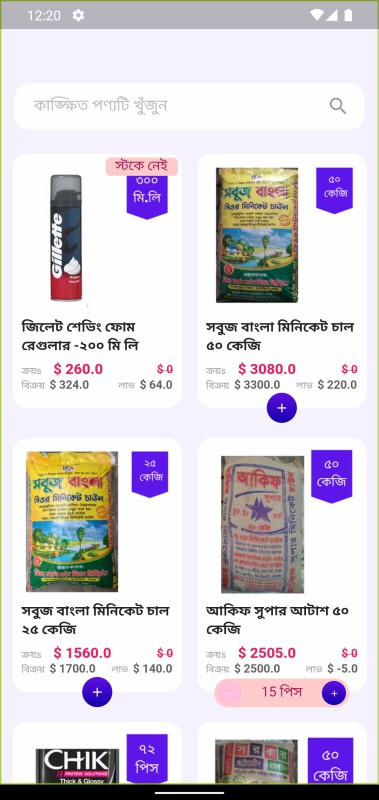
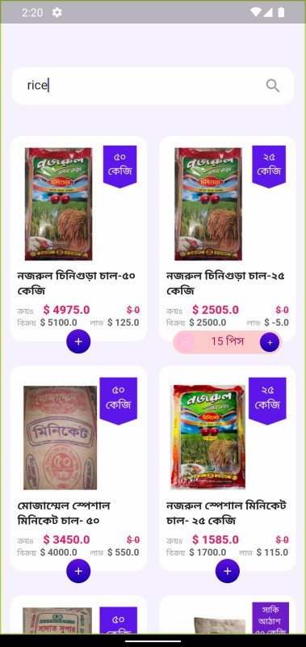
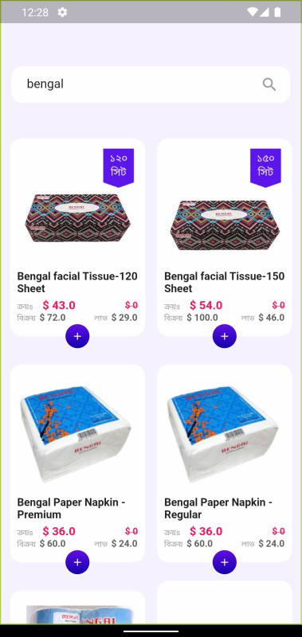
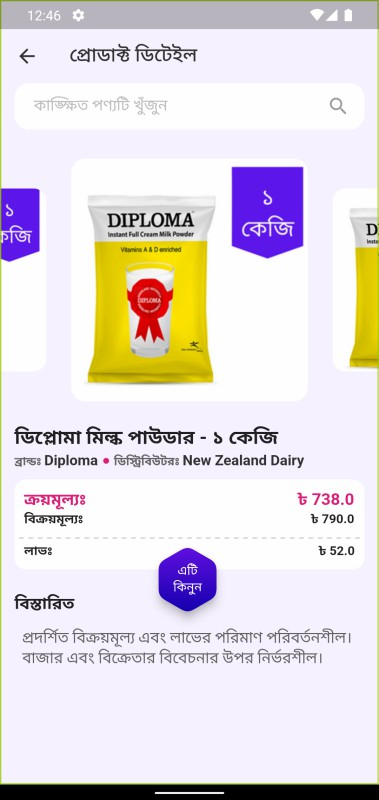
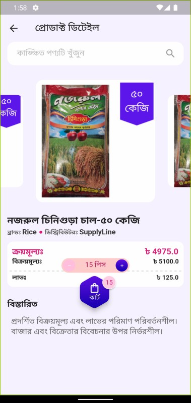

# Qtec Shop 🏪
A grocery item shop app.

><b>Platforms:</b> Android, iOS <b>Language/SDK:</b> Dart, Flutter

## **🎈 Screenshots**
&emsp;
&emsp;
 
&emsp;
 

## **🎈 Features**
* Products GridView with bouncing scroll effect.
* Infinity scroll with loader card.
* Search by search query and product name.
* Product image slider in details Page.
* Add to Cart and quantity updater buttons in Products Page.
* Stockout badge with product card.
* Hexa Cart and quantity updater buttons in details Page.
* Cart quantity badge in Hexa Cart button.
* Other more features..

## **🎈 Remarks**

Click to collapse/fold.

* State management: Bloc & Cubit.
* Packages: flutter_bloc, equatable, cached_network_image, flutter_html, carousel_slider, http, badges, hexagon.

